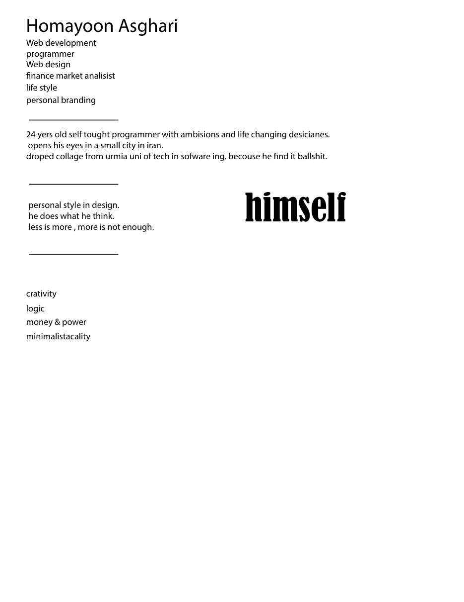

# Design Archive — 2020

Seventy Adobe Illustrator files, PDFs and exports from a two-month freelance logo run, **2 February to 12 April 2020**. Eight jobs: one personal monogram, six client logos, and one unpaid public-health campaign made in the first week of Iran's COVID-19 lockdown.

Binary design sources, committed verbatim at their real modification times. The sources themselves have not been re-exported, re-saved or cleaned up; rendered PNG previews were added separately in a dated 2026 commit so the work is viewable on GitHub.

---

## Provenance

> This repository was reconstructed in 2026 from a filesystem archive. These files were never under version control at the time.
>
> **Commit dates are the real modification times of the original files**, recovered with `stat`, accurate to the second. The work happened between **2020-02-02 09:16** and **2020-04-12 07:03** local time (UTC+03:30). Three commits are dated 2026 — the README, plus any rendered previews or corrections. Each says which it is in its commit message.
>
> One limit worth stating: a modification time is not an authorship time. It records when a file was last written, which for a copied or re-saved file is later than when the work was done. This drive holds duplicated trees, so some files were certainly moved between them. These dates are therefore a faithful transcription of the filesystem's timeline and a **floor** on when the work happened — not independent proof of authorship on that date.

On disk this was two locations — `Project/AIs/` and five files loose in `Project/` — with the same job appearing in both. They are merged here by job. Where the same filename existed in both places, the copy from `AIs/` is suffixed `(AIs copy)`; the two versions are minutes apart and differ by a few dozen bytes, which is what "Save As" leaves behind.

## Previews

**GitHub cannot display `.ai` files** — they render as a download link. Every `.ai` source in this repository has a rendered PNG under `previews/`, mirroring the folder layout (26 of the 27 binary sources; `personal/ha1.pdf` is already a PDF and renders in the browser). Illustrator files are PDF-compatible, so these were rendered directly from the committed sources with PyMuPDF in 2026, one image per artboard. They are renders of the originals, not new artwork, and they are committed in a clearly dated 2026 commit. Where a raster export already existed in the 2020 archive, that original export is committed too, alongside the source.


### The page that explains the rest of this drive

`personal/ha.ai` opens with a self-written brief, February 2020. It is reproduced here as written, typos included:

> **Homayoon Asghari** — Web development · programmer · Web design · finance market analisist · life style · personal branding
>
> 24 yers old self tought programmer with ambisions and life changing desicianes. opens his eyes in a small city in iran. droped collage from urmia uni of tech in sofware ing. becouse he find it ballshit.
>
> personal style in design. he does what he think. less is more, more is not enough.
>
> crativity · logic · money & power · minimalistacality



Written five years before any of it was public.

### Lawyers' Club — باشگاه وکلا


A custom Persian wordmark. The `ک` and `گ` letterforms are drawn as stacked books.

### We Stay Home — خانه میمانیم

The COVID-19 campaign, March–April 2020. Browse `previews/we-stay-home/` and `we-stay-home/` for the full set.

## The jobs

### `personal/` — the HA monogram · 2–8 February

Where it starts. `FIRST LOGO.ai`, dated **2020-02-02 09:16**, is literally the first thing I ever drew in Illustrator.

| File | Modified |
|---|---|
| `FIRST LOGO.ai` | Feb 2 |
| `ha1.pdf` | Feb 3 |
| `ha [Recovered].ai` (+ `AIs copy`) | Feb 5 |
| `abstract.ai` — 11 MB | Feb 6 |
| `repititive face.ai` | Feb 7 |
| `ha 2.ai`, `ha.ai` (+ `AIs copy`) | Feb 8 |

Six days from the first file to a finished HA monogram. Two of the filenames say `[Recovered]`, which is Illustrator's crash-recovery prefix — the application died and offered the file back, and I kept the recovered name rather than saving over it. `repititive` is misspelled. Both preserved.

### `cafe-yadak/` — Café Yadak · 12 & 18 February

*Yadak* (یدک) means "spare part". A café named after car parts. Two rounds, six days apart, the second five times the file size of the first.

### `lawyers-club/` — باشگاه وکلا, "Lawyers' Club" · 13 & 18 February

A legal association. Two rounds. The second file is named `باشگاه وکلا.ai2.ai` — I typed the extension into the filename and then Illustrator added its own. Preserved as it was.

### `we-stay-home/` — در خانه می‌مانیم · 29 March – 1 April

**The one that matters.**

*Dar khāne mimānim* — "We stay at home." Iran was among the first countries outside China hit by COVID-19, and the lockdown began in the last week of March 2020. This was made in the first week of it: an unpaid public-health social campaign, four days of work, **21 finished raster exports** sized for Instagram.

The working files trace the whole thing:

| File | Persian | Modified |
|---|---|---|
| `در خانه میمانیم.ai` | "we stay at home" | Mar 29 11:56 |
| `Untitled-1.ai` — 1.5 MB | — | Mar 31 13:16 |
| `در خانه میمانیم [Recovered].ai` | Illustrator crash recovery | Mar 31 13:16 |
| `Untitled-1 [Recovered].ai` | — | Apr 1 14:06 |
| `نهایی.ai` | **"final"** | Apr 1 14:06 |

The last two files were saved **two seconds apart**, and one of them is named *final*. That is the end of the job and the last thing in this directory.

Included as reference material and **not my work**: `social-media-image-sizes-instagram.jpg` (a sizing cheat-sheet), `covid19-coronavirus-virus-green-cartoon-smile-png-clip-art.png` (downloaded clip art), and three `images*.jfif` and two hash-named JPGs that are search-result thumbnails used for reference.

### `mabna/` — مبنا · 1–3 April

*Mabnā* means "foundation" or "basis". Four `.ai` files and two JPG exports. Two of the source files are named `شسش` and `سشیسی` — those are not Persian words. They are what you get typing `sasas` and `sisisi` on a Persian keyboard layout: keyboard mash, saved as filenames, four days into a lockdown.

### `vb/` · 4–5 April

Two rounds of logo work (`vb.ai`, `vb2.ai`) plus a folder of downloaded reference. **Most of the raster files in this directory are not mine** — see Attribution.

### `start/` — استارت · 7 April

Latin and Persian lockups of the same mark, `start.ai` and `استارت.ai`, plus two JPG exports. A single day.

### `jet/` · 11–12 April

`jet.ai` and one reference PNG. The last file in the archive. Nothing after 12 April 2020.

## What is wrong with it

- **It is undated, untitled and unversioned by any convention.** `Untitled-1.ai`, `Untitled-2.ai`, `4654.ai`, `شسش.ai`, `sa.jpg`, `55.jpg`, `555.jpg`, `556.jpg`, `56.jpg`, `57.jpg`. There is no way to tell a client presentation from a scratch save except by opening it. The only reason this repository can be organised at all is that the mtimes survived.
- **`[Recovered]` appears in four filenames.** Illustrator crashed at least four times and I saved the recovery file rather than the original each time. The originals are gone.
- **No client is identified beyond a two-letter folder name.** `vb`, `jet`, `start` — I no longer know who two of these were for.
- **Nothing is a brief.** There is not one written note, spec, or client requirement anywhere in the archive. Only output.
- **The reference material is undifferentiated from the work.** Downloaded stock, competitor logos and my own vectors sit in the same flat folder with the same kind of filename. Untangling which is which, six years later, took longer than any single one of these jobs took to draw.
- **`repititive face.ai`** — misspelled, and 1.3 MB for a file whose contents I cannot describe from the name.

## Attribution

The vector logo work in the `.ai` files is mine. The following are **not**, and are flagged rather than removed where they were part of the working directory:

- `vb/aparat-logo--black-white.zip` — the official brand asset pack of **[Aparat](https://www.aparat.com)**, the Iranian video platform. Aparat's property, downloaded as reference. **Excluded from this repository.**
- `vb/typography.zip` — 25.6 MB of commercial Persian typefaces I did not license. **Excluded.**
- `vb/ir-02.zip` — a downloaded vector pack. **Excluded**; the `ir-02.png` preview is kept so the reference is visible.
- `vb/pngfuel.com.png`, `vb/unnamed.png`, `vb/download.jpg`, `vb/27185970.jpg`, `vb/logo.png`, `vb/agha.png`, `vb/fa5ba1ab9cecd0c7f6df30db9d17a25a.png` — downloaded reference images. Filenames like `download.jpg`, `unnamed.png` and a 32-character hash are what a browser names a saved image. Kept, because removing them would misrepresent how the folder actually worked, but none of them are my design.
- `jet/37b7bc8f27041fd8ea0b597c6d07e9dc.png` — same: a saved reference image.
- `we-stay-home/` reference files, listed in that section above.
- Any typeface rendered inside an `.ai` file is a commercial Persian or Latin font, not mine.

**One file was removed outright.** `AIs/خانه میمانیم/` contained `پیشنهاد هیئت مدیره به مجمع در خصوص افزایش سرمایه.pdf` — "Board of directors' proposal to the general assembly regarding a capital increase", a 2.4 MB corporate financial document dated 28 March 2020. It is not design work, it is not mine, and it appears to have been saved into that folder by accident. It is excluded.

## Layout

```
personal/      9 files   Feb 2–8     the HA monogram, from the first file ever
cafe-yadak/    2 files   Feb 12–18   "Café Spare-Part"
lawyers-club/  2 files   Feb 13–18   باشگاه وکلا, a legal association
we-stay-home/ 34 files   Mar 29–Apr 1  در خانه می‌مانیم, COVID-19 public health
mabna/         6 files   Apr 1–3     مبنا, "foundation"
vb/           11 files   Apr 4–5
start/         4 files   Apr 7       استارت
jet/           2 files   Apr 11–12   the last work in the archive
```

Filenames are preserved exactly as they were, misspellings, Persian, spaces and all.
